# LangSmith

## Introduction

LangSmith คือเครื่องมือที่เอาไว้ดูว่า AI ของเราทำงานยังไงบ้าง มันช่วยให้เราดูได้ว่าโมเดลคิดอะไรไปทีละขั้น เรียกใช้อะไรบ้าง ช้าหรือเร็วตรงไหน และผลลัพธ์ออกมาดีแค่ไหน

## การเรียกใช้งาน LangSmith Tracing

การใช้งาน LangSmith Tracing จำเป็นต้องทำการ Enable tracing ก่อน โดยกำหนดค่า Environment Variables ดังนี้

~~~bash
export LANGSMITH_TRACING=true
export LANGSMITH_API_KEY=<your-api-key>
~~~

เมื่อทำการ Enable แล้ว ระบบจะเริ่มทำการบันทึก (Trace) การทำงานของ LLM และ Workflow ที่เกี่ยวข้องทั้งหมดโดยอัตโนมัติ **ไม่จำเป็นต้องแก้ไขโค้ดเพิ่มเติม** ระบบจะทำการ Hook การทำงานในจุดสำคัญต่าง ๆ โดยอัตโนมัติผ่าน Layer ของ Framework ที่ใช้เรียก LLM โดยมีดังนี้

- **LangChain**
- **LangGraph**

LangSmith ทำหน้าที่เป็น Observability Layer ที่เกาะอยู่กับ LangChain / LangGraph เป็นหลัก

## Tracing Overview Dashboard

หน้าสำหรับตรวจสอบภาพรวมการทำงานของระบบ ซึ่งแสดงข้อมูลสรุปในช่วง 7 วันย้อนหลัง (รูปที่ 1)

Dashboard นี้ทำให้รู้และประเมินสถานะของระบบได้ว่าตอนนี้โอเคไหม มีคนใช้งานเยอะแค่ไหน ระบบช้าหรือเร็ว เสถียรดีหรือไม่ และใช้ค่าใช้จ่ายไปประมาณเท่าไหร่

  
*รูปที่ 1: หน้า Dashboard ของ LangSmith ที่เอาไว้ดูภาพรวมว่าระบบเป็นยังไงบ้างในช่วง 7 วันที่ผ่านมา*

จากรูปที่ 1 ตาราง Tracing Overview จะเป็นตารางที่เอาไว้ดูภาพรวมของแต่ละแอปว่า แอปไหนมีคนเรียกใช้งานเยอะ ระบบช้าหรือเร็ว มี error ไหม และใช้ค่าใช้จ่ายเป็นอย่างไร โดยช่องที่สำคัญและควรดูหลักๆ มีดังนี้

- **Trace Count (7D)**: ปริมาณการใช้งาน ดูว่าแอปไหนถูกเรียกบ่อยหรือเงียบผิดปกติ  
- **Error Rate (7D)**: ระบบมีปัญหาหรือไม่ ถ้ามีค่านี้ขึ้นต้องเข้าไปเช็กทันที  
- **P50 Latency (7D)**: ดูความเร็วปกติ  
- **P99 Latency (7D)**: ดูเคสที่ช้าที่สุด ว่ามีหลุดหรือค้างไหม
- **Total Tokens (7D)**: จำนวน token ที่ใช้งานทั้งหมด 7 วัน  
- **Total Cost (7D)**: ค่าใช้จ่ายรวม ที่ใช้ไปทั้งหมด 7 วัน

## Runs → Traces

หน้า Traces เอาไว้ดูรายการการทำงานของระบบ แต่ละแถวคือการทำงานหนึ่งรอบ ตั้งแต่รับคำสั่งเข้ามา คิด ประมวลผล จนได้คำตอบออกมาครบทั้งกระบวนการ ตัวอย่างการแสดงผลจะเห็นได้จากรูปที่ 2

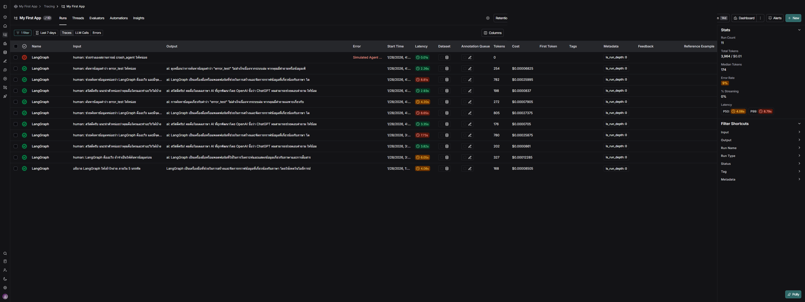
*รูปที่ 2: หน้า Runs → Traces ของ LangSmith แสดงตารางของการทำงานรายตัว และมีการแสดงผลของสถิติของการใช้งาน (Stats) และตัวกรอง (Filter Shortcuts)*

### ตาราง Runs (Traces Table)

ตารางนี้เป็นรายการการทำงานของระบบแต่ละครั้งที่เข้ามา โดยช่องที่ควรดูบ่อยๆ มีดังนี้

- **Name**: บอกว่าการรันนี้มาจากส่วนไหนของระบบ
- **Input**: คำสั่งหรือ prompt ที่ส่งเข้าไป
- **Output**: คำตอบที่ LLM สร้างออกมา ใช้ดูว่าผลลัพธ์โอเคไหม
- **Error**: ถ้ามีปัญหาหรือรันพัง จะเห็นตรงนี้ทันที
- **Start Time**: เวลาที่เริ่มรัน ใช้ดูว่าเหตุการณ์เกิดขึ้นตอนไหน
- **Latency**: ใช้เวลากี่วินาทีตั้งแต่ต้นจนจบ ดูว่าช้าหรือเร็ว
- **Tokens**: ใช้ token ไปเท่าไหร่ในรันนี้
- **Cost**: ค่าใช้จ่ายของการรันครั้งนี้

---

### Stats Panel (ด้านขวา)

ส่วนของ Stats แสดงข้อมูลสรุปของการทำงานทั้งหมดในช่วงเวลาที่เลือก ว่าระบบทำงานหนักแค่ไหน ช้าหรือเร็ว มีปัญหาหรือเปล่า

- **Run Count**: จำนวนครั้งที่ระบบถูกรันทั้งหมด
- **Total Tokens**: จำนวน token ที่ใช้ไปทั้งหมดในช่วงนั้น
- **Median Tokens**: จำนวน token โดยประมาณต่อการรันหนึ่งครั้ง
- **Error Rate**: มีรันที่พังหรือ error กี่เปอร์เซ็นต์
- **% Streaming**: กี่เปอร์เซ็นต์ที่เป็นการตอบกลับแบบทยอยส่ง
- **Latency (P50 / P99)**: ความเร็วของระบบ P50 คือความเร็วปกติที่เจอส่วนใหญ่ และ P99 คือเคสที่ช้าที่สุด เอาไว้เช็กว่ามีหลุดช้ามากไหม

---

### Filter Shortcuts

Filter Shortcuts เอาไว้ช่วยกรอง การทำงานแต่ละครั้งของระบบ สามารถเลือกจุดที่จะดูได้ จะได้ไม่ต้องไล่ดูทั้งหมด

- **Input**: ค้นหา trace จากข้อความหรือคำสั่งที่ส่งเข้าไป
- **Output**: ค้นหาจากคำตอบที่ระบบตอบออกมา
- **Run Name**: เลือกดูตามชื่อ run หรือส่วนของระบบ
- **Run Type**: แยกประเภทการทำงาน เช่น เป็น LLM, chain หรือ tool
- **Status**: เลือกดูเฉพาะเคสที่รันผ่าน หรือเคสที่รันไม่ผ่าน
- **Metadata**: กรองจากข้อมูลเพิ่มเติมที่ผูกไว้กับ trace

## LangSmith Tracing

หน้านี้คือหน้า Trace สำหรับแอปที่ใช้ LangGraph เอาไว้ดูว่า Agent หรือ Graph ทำงานยังไงในแต่ละครั้งที่มีการเรียกใช้งานตั้งแต่รับคำสั่งเข้ามา คิดอะไร ทำขั้นตอนไหนบ้าง จนได้คำตอบออกมา

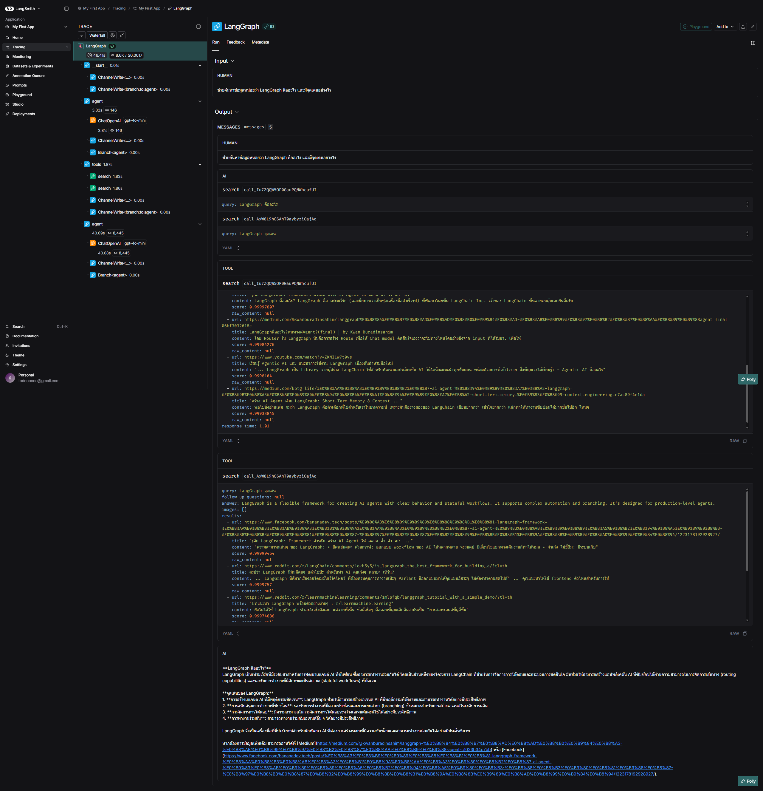
*รูปที่ 3: หน้าจอ LangSmith Tracing ที่โชว์ลำดับการทำงานของ LangGraph พร้อมให้ดู input และ output ของแต่ละขั้นตอนแบบละเอียด*

### แถบซ้าย: Trace Tree / Waterfall

ด้านซ้ายคือ Timeline ของการทำงานทั้งหมดใน 1 request ส่วนหลักๆของการทำงานจะมีดังนี้

- **start**: จุดเริ่มต้น คือส่วนที่ระบบรับคำสั่งหรือ request เข้ามา
- **agent**: ส่วนที่ agent เริ่มคิดและตัดสินใจว่าจะทำอะไรต่อ เช่น จะตอบเองหรือไปเรียกใช้ tools
- **tools**: ส่วนที่ agent ไปเรียกใช้เครื่องมือหรือ service อื่นๆ ตามที่ตั้งค่าไว้
- **ChannelWrite / Branch**: การเขียน state หรือแตก branch ใน LangGraph

จะมีตัวนับเวลารวมทั้งหมดของรันนั้นๆ และตามแต่ละขั้นตอนใช้เวลาไปเท่าไหร่ เพื่อที่จะได้เห็นว่าขั้นตอนไหนใช้เวลานานสุด

อธิบายการทำงานในแต่ละขั้นตอนดังนี้

- **start**: รับค่าของ Input เพื่อส่งต่อไปยังขันตอนต่อไป จะมีบอกอยู่ว่าส่วนต่อไปที่จะทำงานคืออะไรดูได้จาก ChannelWrite<<branch:to:agent>> บอกว่า node ถัดไปคือ agent
- **agent**: นำค่าที่ได้จาก Input มาใช้งานต่อทำการเรียกใช้ LLM และกำหนด Model ที่จะใช้ แล้วทำการตัดสินใจว่าจะตอบเองหรือเรียกใช้ tools
- **tools**: ส่วนของการทำงานที่ทำการไปดึงข้อมูลจากแหล่งต่างๆมาให้ที่ไม่ได้รวมอยู่ใน LLM เมื่อได้ข้อมูลแล้วจะทำการส่งต่อไปที่ agent เพื่อที่จะทำงานต่อ ในการตัดสินใจว่าข้อมูลที่ได้เพียงพอหรือยัง

หลักการทำงานใน State จะวนซ้ำจน agent ตัดสินใจว่าข้อมูลเพียงพอแล้วจึงทำการส่งคำตอบออกไป

## Monitoring Dashboard

## Trace

### Trace Count

*รูปที่ 3: กราฟนี้ใช้ดูว่า **ระบบถูกเรียกใช้งานกี่ครั้งในแต่ละช่วงเวลา** ช่วยให้รู้ว่ามี request เข้ามาหรือไม่ และการทำงานนั้น **สำเร็จ (Success)** หรือ **เกิดข้อผิดพลาด (Error)***

---

### Trace Latency

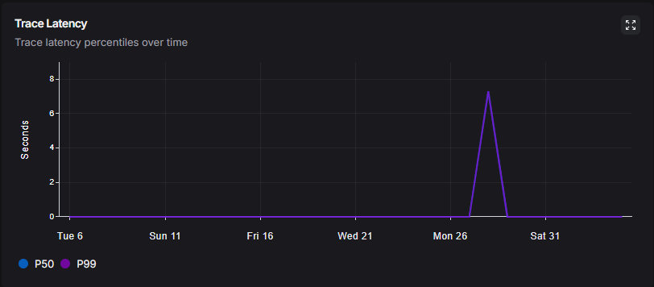

*รูปที่ 4: กราฟนี้ใช้ดูว่า **แต่ละ trace ใช้เวลาทำงานนานแค่ไหน** เอาไว้เช็กความเร็วของระบบ และดูว่ามีช่วงไหนที่ทำงานช้าผิดปกติหรือไม่*

---

### Trace Error Rate

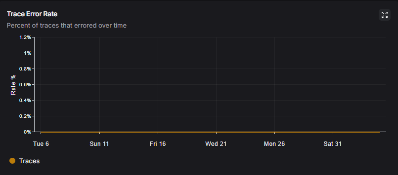

*รูปที่ 5: กราฟนี้ใช้ดูว่า **trace ที่รันแล้ว error คิดเป็นกี่เปอร์เซ็นต์** ถ้าค่าใกล้ 0% แปลว่าระบบค่อนข้างเสถียร*

---

## LLM Calls

### LLM Count

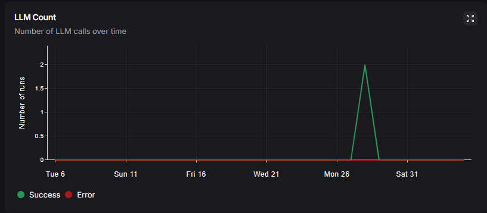

*รูปที่ 6: กราฟนี้ใช้ดูว่า **ระบบเรียกใช้งาน LLM กี่ครั้งในแต่ละช่วงเวลา** ช่วยให้เห็นภาพรวมว่ามีการใช้งานโมเดลมากหรือน้อย*

---

### LLM Latency

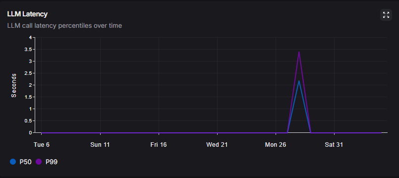

*รูปที่ 7: กราฟนี้ใช้ดูว่า **LLM ตอบกลับเร็วหรือช้าแค่ไหน** ใช้ตรวจสอบ performance ของโมเดลโดยตรง*

---

## Cost & Tokens

### Total Cost

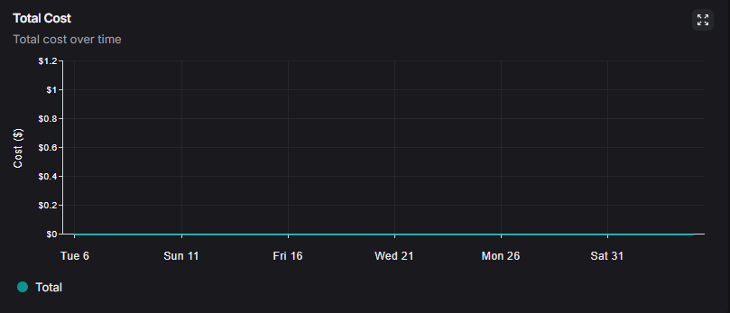

*รูปที่ 8: กราฟนี้ใช้ดูว่า **ค่าใช้จ่ายรวมจากการใช้งานระบบ** เช่น การเรียก LLM เพื่อช่วยติดตามและควบคุมงบประมาณ*

---

### Output Token

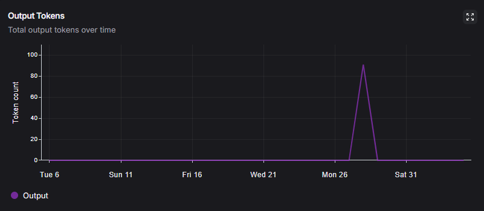

*รูปที่ 9: กราฟนี้ใช้ดูว่า **LLM สร้างข้อความออกมากี่ token** ช่วยดูว่าคำตอบที่ได้ยาวหรือสั้นแค่ไหน*

---

### Output Token Per Trace

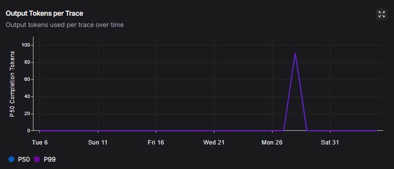

*รูปที่ 10: กราฟนี้ใช้ดูว่า **หนึ่ง trace ใช้ output token กี่ token** เหมาะสำหรับควบคุมความยาวคำตอบและค่าใช้จ่าย*

---

### Input Token

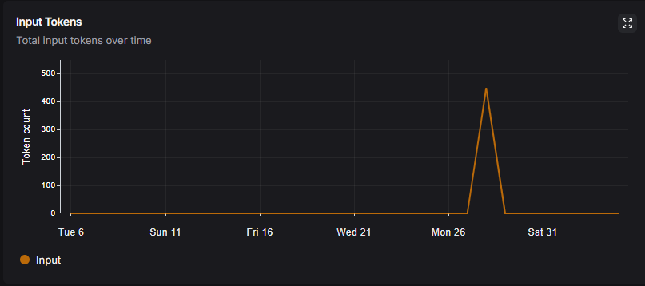

*รูปที่ 11: กราฟนี้ใช้ดูว่า **ระบบส่ง prompt เข้าไปให้ LLM กี่ token** ช่วยวิเคราะห์ปริมาณข้อมูลที่ส่งให้โมเดล*

---

### Input Token Per Trace

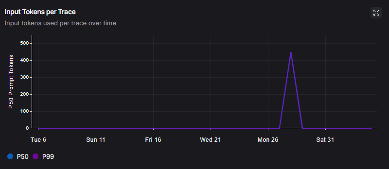

*รูปที่ 12: กราฟนี้ใช้ดูว่า **prompt ต่อหนึ่ง trace ยาวแค่ไหน** ช่วยปรับ prompt ให้ไม่ยาวเกินจำเป็น*

---

## Tools

### Run Count by Tool

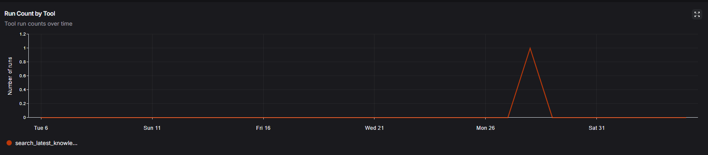

*รูปที่ 13: กราฟนี้ใช้ดูว่า **agent เรียกใช้ tool ไหนบ่อยแค่ไหน** ช่วยวิเคราะห์พฤติกรรมการทำงานของ agent*

---

### Median Latency by Tool

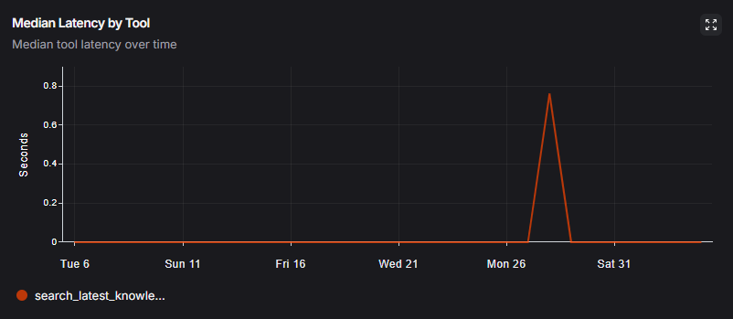

*รูปที่ 14: กราฟนี้ใช้ดูว่า **แต่ละ tool ใช้เวลาทำงานโดยเฉลี่ยนานแค่ไหน** ช่วยหา tool ที่ทำงานช้าผิดปกติ*

---

### Error Rate by Tool

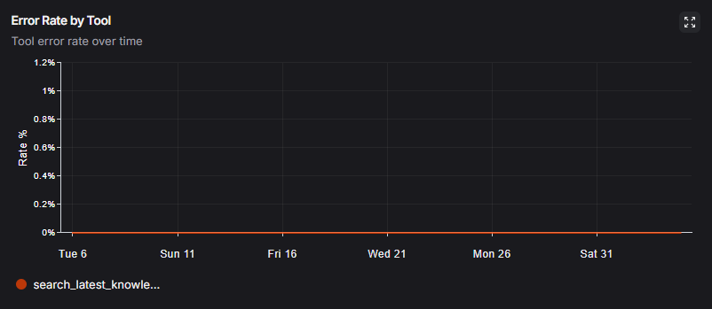

*รูปที่ 15: กราฟนี้ใช้ดูว่า **tool ไหนเกิด error บ่อย** ใช้ตรวจสอบความเสถียรของ tool แต่ละตัว*

---

## Run Types

### Run Count by Name (depth = 1)

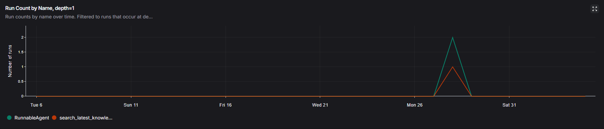

*รูปที่ 16: กราฟนี้ใช้ดูว่า **component หลักของระบบ (depth = 1)** ถูกเรียกใช้งานกี่ครั้งในแต่ละช่วงเวลา*

---

### Median Latency by Run Name (depth = 1)

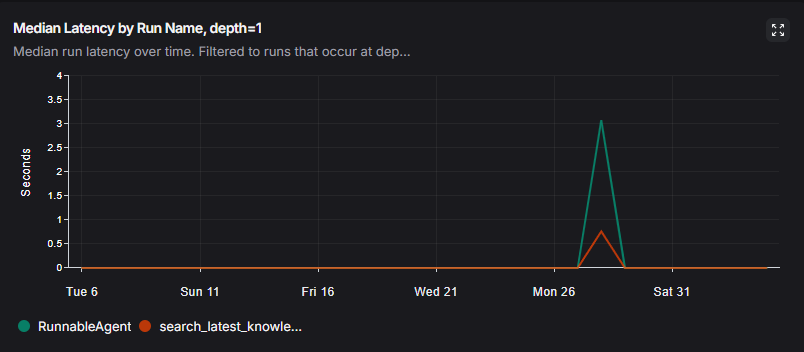

*รูปที่ 17: กราฟนี้ใช้ดูว่า **component หลักแต่ละตัวใช้เวลาทำงานนานแค่ไหน** ช่วยหาจุดที่ระบบทำงานช้าใน flow หลัก*

---

### Error Rate by Run Name (depth = 1)

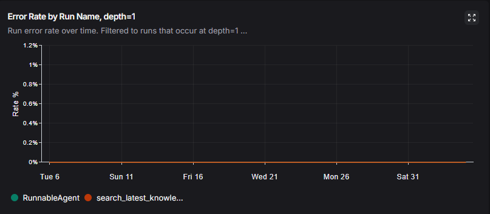

*รูปที่ 18: กราฟนี้ใช้ดูว่า **component หลักตัวไหน error บ่อย** ใช้ตรวจสอบความเสถียรของ flow หลักทั้งระบบ*
